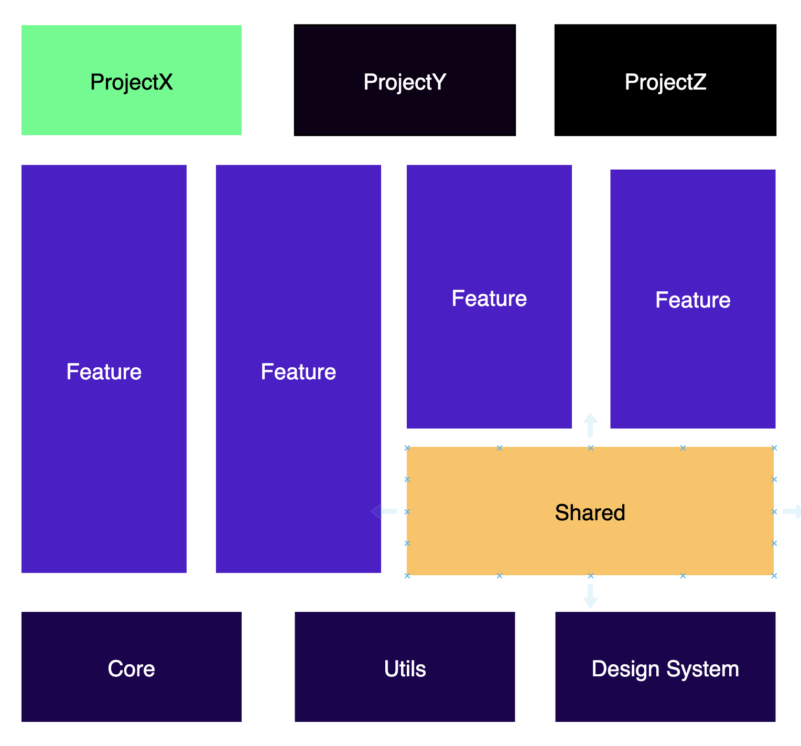
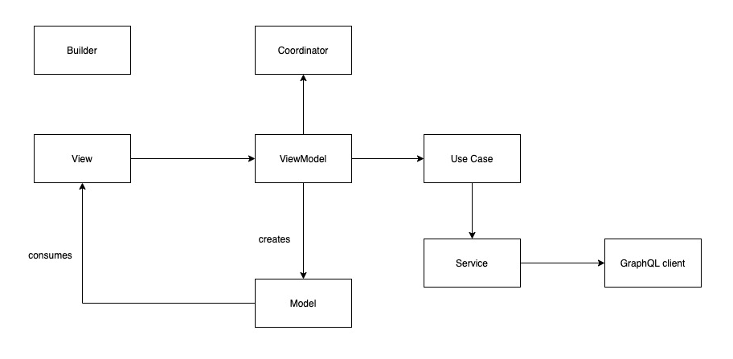

# iOS Architecture

This document describes the current architecture approach for the iOS App.

## Holistic App Architecture

The application is structured using modularised architecture In this architecture, the App is separated into totally isolated Feature modules which depend on Shared and Core modules. Having isolated modules so people can work easily in separate cross-functional teams and it's easy to reuse modules as frameworks.



## Module Architecture

Each Module is using a [Model-View-ViewModel (MVVM)](https://en.wikipedia.org/wiki/Model%E2%80%93view%E2%80%93viewmodel) architecture pattern with two additional patterns added:

- [Builder design pattern](https://en.wikipedia.org/wiki/Builder_pattern) - To construct objects and help with dependency management
- [Router pattern](https://www.objc.io/issues/13-architecture/viper/#routing) - A router (from the VIPER architecture) to abstract routing logic to a separate object which can reduce the amount of logic in the ViewController

By using these two additional patterns the architecture could be called MVVM-CB (Model-View-ViewModel-Coordinator-Builder).

All objects are defined by interfaces (`protocols`) to enable replacing them with mocked versions during (unit) testing. 

Examples: 

- `Builder`s are defined by `Buildable` interfaces
- `Coordinator`s are defined by `Coordinating` interfaces
- `ViewController`s are defined by `Presentable` or `NavigationControllable` interfaces




### Module

This is a modularized architecture, which means every isolated feature/functionality in the app is called a module. 

A module always consists of at least a `Builder` together with the object it builds. In most cases `Builder`s build `Coordinator`s. for example:
- `Builder` builds a `Module` which wraps a `Coordinator` which uses a `ViewController` to present other `viewController`s

What is unique in this architecture is that `Coordinators` talk to each other. To know what's that means let me take you on a small trip:
Let's say there are two modules `Module A` and `Module B`. Now from `Module A` would need to navigate to `Module B` to do that `Module A` coordinator would have to first ask the `Module B` builder to build the module(which is a wrapper around a coordinator). Once `Module A` gets `Module B` coordinator it would then call a method to start it. 
To achieve that a generic type called `Module` that wraps a coordinator is used:
``` swift
public struct Module<T> {
    public let coordinator: BaseCoordinator<T>
    
    public init(coordinator: BaseCoordinator<T>) {
        self.coordinator = coordinator
    }
}
```

Some examples of modules are: 
- Map (consists of `MapModuleBuilder`, `MapCoordinator`, `MapUseCase` and `MapViewController`)

### Builder Pattern

To simplify object(Module) creation, and to remove the need to deal with dependencies during object creation, `Builder`s are used. `Builder`s can define the dependencies they require by creating a `Dependency` interface:

``` swift
/// Provides all dependencies to build the VenueDetailsModuleBuilder
public protocol VenueDetailsDependency {
    var session: Session { get }
    var networkRechabilityManager: NetworkReachabilityManager? { get }
}
```

A builder specifies which dependency it requires, or can use `EmptyDependency` if no parent dependencies are needed:


``` swift
// 1)
public protocol VenueDetailsModuleBuildable: ModuleBuildable {
    func buildModule<T>(with rootViewController: NavigationControllable, venue: Venue, venuePhotoURL: String?) -> Module<T>?
}

// 2)
/// Provides all dependencies to build the VenueDetailsModuleBuilder
private final class VenueDetailsDependencyProvider: DependencyProvider<VenueDetailsDependency> {
    
    var session: Session { return dependency.session }
    fileprivate var networkRechabilityManager: NetworkReachabilityManager? { return dependency.networkRechabilityManager }
    fileprivate var tipsModuleBuilder: TipsModuleBuildable { TipsModuleBuilder() }
}

// 3)
public class VenueDetailsModuleBuilder: Builder<VenueDetailsDependency> , VenueDetailsModuleBuildable {
    
    public func buildModule<T>(with rootViewController: NavigationControllable, venue: Venue, venuePhotoURL: String?) -> Module<T>? {
        let venueDetailsDependencyProvider = VenueDetailsDependencyProvider(dependency: dependency)
        
        registerService(session: venueDetailsDependencyProvider.session)
        registerUsecase(networkRechabilityManager: venueDetailsDependencyProvider.networkRechabilityManager)
        registerMapURLHandler()
        registerViewModel(venue: venue, venuePhotoURL: venuePhotoURL)
        registerView()
        registerCoordinator(rootViewController: rootViewController, tipsModuleBuilder: venueDetailsDependencyProvider.tipsModuleBuilder)
        
        guard let coordinator = container.resolve(VenueDetailsCoordinator.self) else {
            return nil
        }
        
        return Module(coordinator: coordinator) as? Module<T>
    }
}
```

First, an interface is defined that describes the `VenueDetailsModuleBuilder`: its `buildModule` function and the interface of the to-be-built object. Any dynamic dependency (for example, a `venue` or `venuePhotoURL`) can be passed as an argument to the `buildModule` method. 

Note: Usually builders return generic type `Module` to not leak implementation details to the call site. For example, it usually does not make sense for the parent module to call into coordinating functions of a child module.

Secondly, a `DependencyProvider` is created. `DependencyProvider`s can be constructed by the Builder to get dependencies from. Any local dependency can be constructed directly by the DependencyProvider:

``` swift
private final class VenueDetailsDependencyProvider: DependencyProvider<VenueDetailsDependency> {
    // dependencies defined here can use parent dependencies from the `dependency` variable 
    var session: Session { return dependency.session }
    fileprivate var networkRechabilityManager: NetworkReachabilityManager? { return dependency.networkRechabilityManager }
    fileprivate var tipsModuleBuilder: TipsModuleBuildable { TipsModuleBuilder() }
}
```

These dependencies can be used by child builders later on. For an example, see the below Coordinator section.

Finally (3), a concrete `Builder` class is created. Its structure follows the same pattern: a `DependencyProvider` is created, any intermediate objects (in this case `VenueDetailsViewController`) are created and the final Module is constructed and returned.

### Coordinator

The Coordinator concept comes from VIPER (Router) and is used to extract router specific logic. A `Coordinator` has an associated `ViewController` that it uses to route with. 
Usually, coordinators call `present`/`dismiss`/`push`/`pop` methods on their `viewControllers`. ViewModels uses coordinators to initiate routing requests. 

A module with a coordinator is structured as follow:
`Builder` -> builds -> `Coordinator` -> uses `ViewController` -> uses `ViewModel` -> calls back into the same coordinator.

And Builder is usually created from previous screen's (Previous)Coordinator.

The relationship between coordinator and view model is established when creating the coordinator in the builder for example: 

```swift   
    func registerCoordinator(rootViewController: NavigationControllable? = nil, tipsModuleBuilder: TipsModuleBuildable) {
        container.register(VenueDetailsCoordinator.self) { [weak self] in
            guard let viewController = self?.container.resolve(VenueDetailsViewController.self) else {
                return nil
            }
            
            let coordinator = VenueDetailsCoordinator(rootViewController: rootViewController, viewController: viewController, tipsModuleBuilder: tipsModuleBuilder)
            coordinator.backButtonTapped = viewController.viewModel.outputs.showMap
            coordinator.showTips = viewController.viewModel.outputs.showTips
            return coordinator
        }
    }
```

```swift  
class VenueDetailsCoordinator: BaseCoordinator<Void> {
    
    private weak var rootViewController: NavigationControllable?
    private let viewController: UIViewController
    private let tipsModuleBuilder: TipsModuleBuildable
    
    var backButtonTapped = PublishSubject<Void>()
    var showTips = PublishSubject<(tips: [TipItem], venuePhotoURL: String?)>()

    init(rootViewController: NavigationControllable?, viewController: UIViewController, tipsModuleBuilder: TipsModuleBuildable) {
        self.rootViewController = rootViewController
        self.viewController = viewController
        self.tipsModuleBuilder = tipsModuleBuilder
    }
    
    override public func start() -> Observable<Void> {
        rootViewController?.pushViewController(viewController, animated: true)
        
        showTips.subscribe { [weak self] (tips: [TipItem], venuePhotoURL: String?) in
            guard let self = self else { return }
            
            guard let tipsCoordinator: BaseCoordinator<Void> = self.tipsModuleBuilder.buildModule(with: self.viewController, tips: tips, venuePhotoURL: venuePhotoURL)?.coordinator else {
                preconditionFailure("Cannot get tipsCoordinator from module builder")
            }
            
            self.coordinate(to: tipsCoordinator).subscribe(onNext: {
            }).disposed(by: self.disposeBag)
        }.disposed(by: disposeBag)
        
        return backButtonTapped.do(onNext: { [weak self] in
           _ = self?.rootViewController?.popViewController(animated: true)
        })
    }
}
```
When the view model's `showTips` observer is notified, `showTips` observer of the coordinator would be notified, and then it would route to the job page module. 

### View Model

A view model is a view’s model. It encapsulates the data needed to populate a particular kind of view and the presentation logic needed to transform that data into properties that can be rendered.

The minimal ViewModel example looks as follows:

``` swift 
protocol VenueDetailsViewModellable: ViewModellable {
    var disposeBag: DisposeBag { get }
    var inputs: VenueDetailsViewModelInputs { get }
    var outputs: VenueDetailsViewModelOutputs { get }
    
    func buildVenueTableHeaderViewData() -> TableStretchyHeader.ViewData
    func buildAddressTableViewCellViewData() -> AddressTableViewCell.ViewData?
    func buildRatingTableViewCellViewData() -> RatingTableViewCell.ViewData?
    func buildPhotoGalleryTableViewCellViewData() -> PhotoGalleryTableViewCell.ViewData?
    func venueLocation() -> Location?
    func buildtipsTableViewCellViewModel() -> TipsTableViewCell.ViewData?
}

struct VenueDetailsViewModelInputs {
    var viewState = PublishSubject<ViewState>()
    var backButtonTapped = PublishSubject<Void>()
    var showMap = PublishSubject<(type: MapType, location: Location)>()
    var itemSelected = PublishSubject<Void>()
}

struct VenueDetailsViewModelOutputs {
    var showVenueDetailsHeader = PublishSubject<TableStretchyHeader.ViewData>()
    var showError = PublishSubject<FoursquareError>()
    var showMap = PublishSubject<Void>()
    var showTips = PublishSubject<(tips: [TipItem], venuePhotoURL: String?)>()
}

class VenueDetailsViewModel: VenueDetailsViewModellable {
    
    let disposeBag = DisposeBag()
    let inputs = VenueDetailsViewModelInputs()
    let outputs = VenueDetailsViewModelOutputs()
    private let useCase: VenueDetailsInteractable
    private let venue: Venue
    private let venuePhotoURL: String?
    private let mapURLHandler: MapURLHandling
    private var viewData: VenueDetailsViewController.ViewData?
    
    init(useCase: VenueDetailsInteractable, venue: Venue, venuePhotoURL: String?, mapURLHandler: MapURLHandling) {
        self.useCase = useCase
        self.venue = venue
        self.venuePhotoURL = venuePhotoURL
        self.mapURLHandler = mapURLHandler
        
        setupObservables()
    }
```

### Inputs
All input variables `PublishSubject` types that are invoked directly when needed from the view.

``` swift 
    let actionButtonTapped = PublishSubject<Void>()
```
### Outputs
All outputs to the external that triggers the next screen action observed by `Coordinator`.

``` swift
    let showJobPage = PublishSubject<String>()
```

